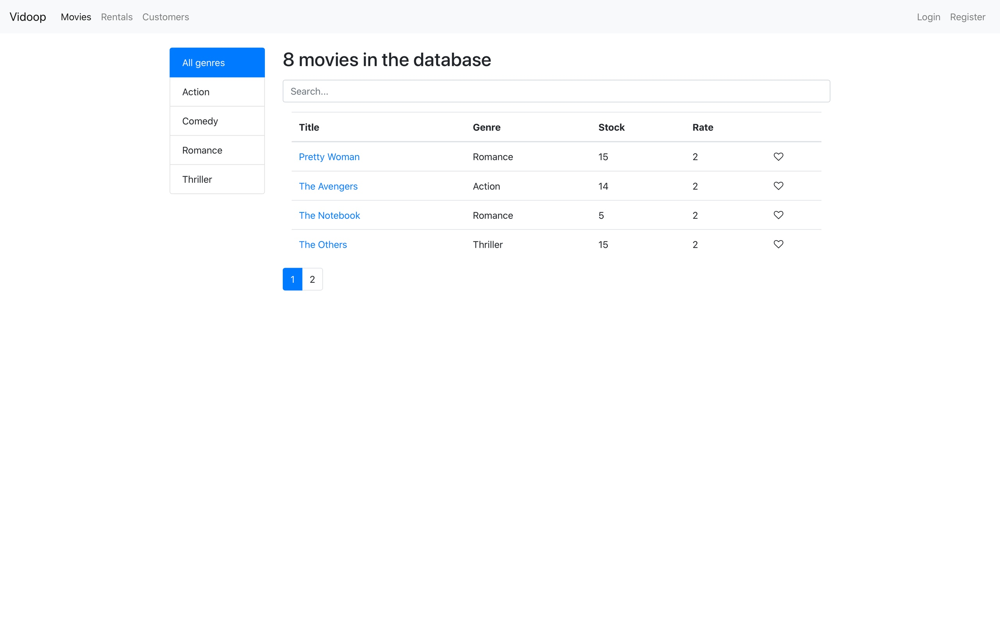

# Библиотека фильмов
### Начальные требования
  Для работы проекта необходимы:
  * node
  * npm
  * mongoDB
   
### Инструкция по установке и запуску
* запускаем скрипт **init.sh** в корне проекта
`bash init.sh`
  Этот скрипт заполнит базу начальными значениями, а также установит зависимости проектов
* запускаем скрипт **startup.sh** в корне проекта `bash startup.sh`
    Этот скрипт запустит оба проекта, после чего фронтенд будет доступен по адресу **http://localhost:3000**, а бэкенд будет слушать запросы по адресу **http://localhost:3900**
  
### Пример корректно запущенного проекта

